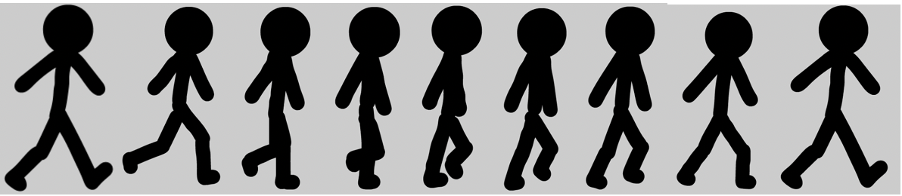

### Flash制作火柴人行走动画

By 16307130362 白玉

#### 动画制作环境

* 选取ADOBE ANIMATE软件作为flash开发工具 https://www.adobe.com/cn/products/animate.html

#### 制作一个简单的火柴人

* 建立一个新的 Scene，添加三个图层（scene layer），分别命名为头、身体、地面

  

* 在Scene不同的图层下绘画

  

#### 设置关键帧，在关键帧上绘制8组不同行走状态的火柴人

#### 完成火柴人在地面上行走的动画

* 创建元件，将动画长度设置为4s，并循环播放
* 4s处设置关键帧，将火柴人位置移动到图像右边，在关键帧之间创建补间动画，完成火柴人从地面左边走到右边的动画
* 完成动画，可以查看gif动画[demo](./huocairen.gif)，也可以[查看fla文件地址](./huocairen.fla)