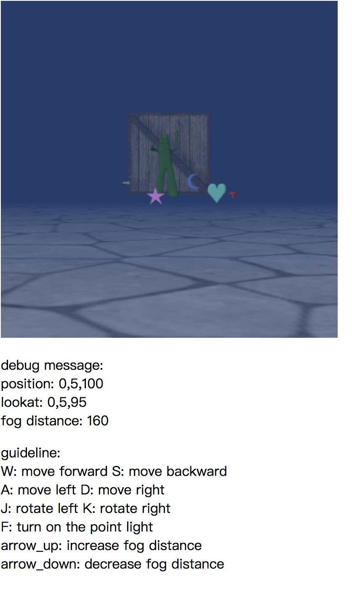

# 基于WebGL绘制漫游式场景

##### by 白玉 16307130362

### 开发运行环境

* **硬件：**带有支持OpenGL ES2.0显卡的计算机 
* **软件：**支持HTML5, JavaScript和WebGL的浏览器，建议选择最新版本的Google Chrome浏览器，也可以选择Internet Explorer 11+或者最新版本的Firefox，Safari等。 

### 用户手册

所有操作方法如下图所示



### 代码结构

* lib 相关配置文件
* src 源文件
  - camera.js 定义了一个Camera类，存储相机的元信息，用于生成viewProjectMatrix
  - fog.js 定义了一个Fog类，存储雾的颜色，雾的距离等，用于计算场景中每个物体的模糊度(mix方法)
  - keyController.js 定义了一个KeyController类，该类对象为物体（该pj中我们的物体就是相机）绑定键盘事件（移动和转动），为雾对象绑定调节深度事件（调节雾的距离范围）
  - MyVector3.js 定义了Vector的一些计算方法，在处理旋转平移涉及向量计算时会用到
  - objLoader.js 定义了加载对象的相关方法
  - objModelShader.js 用于obj对象物体渲染的着色器
  -  textureModelShader.js 用于带纹理物体渲染的着色器
* 3DWalker.html 主页面


### 基本组成

* 3D场景纹理贴图: 用textureModelShader实现
* 模型载入: objLoader与objModelShader实现载入，用modelMatrix,viewMatrix进行模型变换
* 3D场景漫游: 用keyController绑定键盘事件改变fog与camera的参数
* 光照: 添加方向光，平行光及点光源(键盘事件F触发，随camera移动)
* swichingShader: 每次新绘制物体时，切换program，绑定新的buffer来完成swichShader重新绘制

* 雾气的添加

  ```javascript
  // 记录雾的颜色与距离
  // 距离的第一个参数50表示，最小的距离，即调整的范围为（50，无穷大），第二个参数160为距离的初始值。
  // 在160以内的物体会随着距离增加逐渐模糊（通过fogFactor实现），160以外的物体不可见。
  class Fog {
      constructor() {
          this.fogColor = new Float32Array([0.137, 0.231, 0.423]);
          // Distance of fog [where fog starts, where fog completely covers object]
          this.fogDist = new Float32Array([50, 160]);
      }
  }
  ```


### 遇到的问题

* 平移旋转会涉及到很复杂的数学运算，将‘向前W’'向后S'等平移转换到世界坐标系的平移的转换最开始想了很久，如果能够有当前方向向量的垂直法向量就可以辅助进行世界坐标系的转换了，怎么求法向量呢？用叉积。

  ```javascript
  translate(x,y,z) {
          let directionVector = VectorMinus(this.at, this.eye);
          
          let localZ = directionVector.normalize();
          let localY = this.up;
          let localX = VectorCross(localZ, localY);
          let increaseVector = VectorAdd(
              VectorAdd(VectorMultNum(localZ, z),VectorMultNum(localX, x)), 			  
              VectorMultNum(localY, y));
          this.eye = VectorAdd(this.eye, increaseVector);
          this.at = VectorAdd(this.at, increaseVector);
          
  }
  rotate(angle) { //弧度制
          let directionVector = VectorMinus(this.at, this.eye);
          let baseVector = VectorMultNum(directionVector, Math.cos(angle));
          let verticalVector = VectorMultNum(VectorCross(directionVector, this.up), 
                                             Math.sin(angle));
          let newDirectionVector = VectorAdd(baseVector, verticalVector);
          this.at = VectorAdd(this.eye, newDirectionVector);
          
  }
  ```


### 附录

以下是我的shader

```javascript
		
// Texture shader
		const SHADOW_VSHADER_SOURCE =
            'attribute vec4 a_Position;\n' +
            'uniform mat4 u_MvpMatrix;\n' +
            'void main() {\n' +
            '  gl_Position = u_MvpMatrix * a_Position;\n' +
            '}\n';
        const SHADOW_FSHADER_SOURCE =
            '#ifdef GL_ES\n' +
            'precision mediump float;\n' +
            '#endif\n' +
            'void main() {\n' +
            '  const vec4 bitShift = vec4(1.0, 256.0, 256.0 * 256.0, 256.0 * 256.0 * 256.0);\n' +
            '  const vec4 bitMask = vec4(1.0/256.0, 1.0/256.0, 1.0/256.0, 0.0);\n' +
            '  vec4 rgbaDepth = fract(gl_FragCoord.z * bitShift);\n' + // Calculate the value stored into each byte
            '  rgbaDepth -= rgbaDepth.gbaa * bitMask;\n' + // Cut off the value which do not fit in 8 bits
            '  gl_FragColor = rgbaDepth;\n' +
            '}\n';

        const VSHADER_SOURCE =
            'attribute vec4 a_Position;\n' +
            'attribute vec4 a_Normal;\n'+
            'attribute vec2 a_TexCoord;\n' +
            'attribute vec4 a_Color;\n' +


            'uniform mat4 u_MvpMatrix;\n' +
            'uniform mat4 u_ModelMatrix;\n' +   // Model matrix
            'uniform mat4 u_NormalMatrix;\n' +
            'uniform mat4 u_MvpMatrixFromLight;\n' +
            'uniform vec4 u_Eye;\n' +     // Position of eye point (world coordinates)


            'uniform vec3 u_DiffuseLight;\n' +   // Diffuse light color
            'uniform vec3 u_LightDirection;\n' + // Diffuse light direction (in the world coordinate, normalized)
            'uniform vec3 u_AmbientLight;\n' +   // Color of an ambient light
            'uniform vec3 u_PointLightColor;\n' +
            'uniform vec3 u_PointLightPosition;\n' +

            'varying vec2 v_TexCoord;\n' +
            'varying vec4 v_Color;\n' +
            'varying vec4 v_PositionFromLight;\n' +
            'varying float v_Dist;\n' +


            'void main() {\n' +
            '  gl_Position = u_MvpMatrix * a_Position;\n' +
            '  v_TexCoord = a_TexCoord;\n' +

            '  vec3 normal = normalize(vec3(u_NormalMatrix * a_Normal));\n' +
            '  vec4 vertexPosition = u_ModelMatrix * a_Position;\n'+

            '  vec3 pointLightDirection = normalize(u_PointLightPosition - vec3(vertexPosition));\n' +
            '  float pointLightnDotL = max(dot(pointLightDirection, normal), 0.2);\n' +
            '  vec3 pointLightDiffuse = u_PointLightColor * pointLightnDotL;\n' +


            '  float nDotL = max(dot(u_LightDirection, normal), 0.1);\n' +
            '  vec3 diffuse = u_DiffuseLight * nDotL;\n' +
            '  vec3 ambient = u_AmbientLight * 0.1;\n' +

            '  v_Color = vec4(diffuse + ambient + pointLightDiffuse, 1.0);\n' +
            '  v_Dist = distance(u_ModelMatrix * a_Position, u_Eye);\n' +


            '}\n';

        // Fragment shader program
        const FSHADER_SOURCE =

            '#ifdef GL_ES\n' +
            'precision mediump float;\n' +
            '#endif\n' +
            'uniform sampler2D u_Sampler;\n' +
            'uniform sampler2D u_ShadowMap;\n' +

            'uniform vec3 u_FogColor;\n' + // Color of Fog
            'uniform vec2 u_FogDist;\n' +  // Distance of Fog (starting point, end point)

            'varying vec2 v_TexCoord;\n' +
            'varying vec4 v_Color;\n' +
            'varying vec4 v_PositionFromLight;\n' +
            'varying float v_Dist;\n' +

            'float unpackDepth(const in vec4 rgbaDepth) {\n' +
            '  const vec4 bitShift = vec4(1.0, 1.0/256.0, 1.0/(256.0*256.0), 1.0/(256.0*256.0*256.0));\n' +
            '  float depth = dot(rgbaDepth, bitShift);\n' + // Use dot() since the calculations is same
            '  return depth;\n' +
            '}\n' +

            'void main() {\n' +
            '  vec3 shadowCoord = (v_PositionFromLight.xyz/v_PositionFromLight.w)/2.0 + 0.5;\n' +
            '  vec4 rgbaDepth = texture2D(u_ShadowMap, shadowCoord.xy);\n' +
            '  float depth = unpackDepth(rgbaDepth);\n' + // Retrieve the z-value from R
            '  float visibility = (shadowCoord.z > depth + 0.005) ? 0.5 : 1.0;\n' +

            '  float fogFactor = clamp((u_FogDist.y - v_Dist) / (u_FogDist.y - u_FogDist.x), 0.0, 1.0);\n' +
            '  vec3 color = mix(u_FogColor, vec3(v_Color + texture2D(u_Sampler, v_TexCoord)) * visibility, fogFactor);\n' +

            '  gl_FragColor = vec4(color, v_Color.a);\n' +
            //'  gl_FragColor = vec4(color, v_Color.a);\n' +

            '}\n';


// objShader
		const SHADOW_VSHADER_SOURCE =
            'attribute vec4 a_Position;\n' +
            'uniform mat4 u_MvpMatrix;\n' +
            'void main() {\n' +
            '  gl_Position = u_MvpMatrix * a_Position;\n' +
            '}\n';
        const SHADOW_FSHADER_SOURCE =
            '#ifdef GL_ES\n' +
            'precision mediump float;\n' +
            '#endif\n' +
            'void main() {\n' +
            '  const vec4 bitShift = vec4(1.0, 256.0, 256.0 * 256.0, 256.0 * 256.0 * 256.0);\n' +
            '  const vec4 bitMask = vec4(1.0/256.0, 1.0/256.0, 1.0/256.0, 0.0);\n' +
            '  vec4 rgbaDepth = fract(gl_FragCoord.z * bitShift);\n' + // Calculate the value stored into each byte
            '  rgbaDepth -= rgbaDepth.gbaa * bitMask;\n' + // Cut off the value which do not fit in 8 bits
            '  gl_FragColor = rgbaDepth;\n' +
            '}\n';
        const VSHADER_SOURCE =
            'attribute vec4 a_Position;\n' +
            'attribute vec4 a_Color;\n' +
            'attribute vec4 a_Normal;\n' +
            'uniform mat4 u_MvpMatrix;\n' +
            'uniform mat4 u_ModelMatrix;\n' +   // Model matrix
            'uniform mat4 u_NormalMatrix;\n' +
            'uniform vec3 u_DiffuseLight;\n' +   // Diffuse light color
            'uniform vec3 u_LightDirection;\n' + // Diffuse light direction (in the world coordinate, normalized)
            'uniform vec3 u_AmbientLight;\n' +   // Color of an ambient light
            'uniform vec3 u_PointLightColor;\n' +
            'uniform vec3 u_PointLightPosition;\n' +
            'uniform vec3 u_Color;\n' +
            'uniform vec4 u_Eye;\n' +     // Position of eye point (world coordinates)
            'varying vec4 v_Color;\n' +
            'varying float v_Dist;\n' +
            'varying vec4 v_PositionFromLight;\n' +


            'void main() {\n' +
            '  gl_Position = u_MvpMatrix * a_Position;\n' +
            '  vec3 normal = normalize(vec3(u_NormalMatrix * a_Normal));\n' +
            '  vec4 vertexPosition = u_ModelMatrix * a_Position;\n' +

            '  vec3 pointLightDirection = normalize(u_PointLightPosition - vec3(vertexPosition));\n' +
            '  float pointLightnDotL = max(dot(pointLightDirection, normal), 0.0);\n' +
            '  vec3 pointLightDiffuse = u_PointLightColor * u_Color * pointLightnDotL;\n' +

            '  float nDotL = max(dot(u_LightDirection, normal), 0.0);\n' +
            '  vec3 diffuse = u_DiffuseLight * u_Color * nDotL;\n' +
            '  vec3 ambient = u_AmbientLight * u_Color;\n' +

            '  v_Color = vec4(diffuse + ambient + pointLightDiffuse, a_Color.a);\n' +
            '  v_Dist = distance(u_ModelMatrix * a_Position, u_Eye);\n' +

            '}\n';
        const FSHADER_SOURCE =
            '#ifdef GL_ES\n' +
            'precision mediump float;\n' +
            '#endif\n' +
            'uniform sampler2D u_ShadowMap;\n' +

            'uniform vec3 u_FogColor;\n' + // Color of Fog
            'uniform vec2 u_FogDist;\n' +  // Distance of Fog (starting point, end point)

            'varying vec4 v_Color;\n' +
            'varying float v_Dist;\n' +
            'varying vec4 v_PositionFromLight;\n' +

            'float unpackDepth(const in vec4 rgbaDepth) {\n' +
            '  const vec4 bitShift = vec4(1.0, 1.0/256.0, 1.0/(256.0*256.0), 1.0/(256.0*256.0*256.0));\n' +
            '  float depth = dot(rgbaDepth, bitShift);\n' + // Use dot() since the calculations is same
            '  return depth;\n' +
            '}\n' +

            'void main() {\n' +
            '  vec3 shadowCoord = (v_PositionFromLight.xyz/v_PositionFromLight.w)/2.0 + 0.5;\n' +
            '  vec4 rgbaDepth = texture2D(u_ShadowMap, shadowCoord.xy);\n' +
            '  float depth = unpackDepth(rgbaDepth);\n' + // Retrieve the z-value from R
            '  float visibility = (shadowCoord.z > depth + 0.005) ? 0.5 : 1.0;\n' +

            '  float fogFactor = clamp((u_FogDist.y - v_Dist) / (u_FogDist.y - u_FogDist.x), 0.0, 1.0);\n' +
            '  vec3 color = mix(u_FogColor, vec3(v_Color) * visibility, fogFactor);\n' +
            '  gl_FragColor = vec4(color, v_Color.a);\n' +
            '}\n';
```

